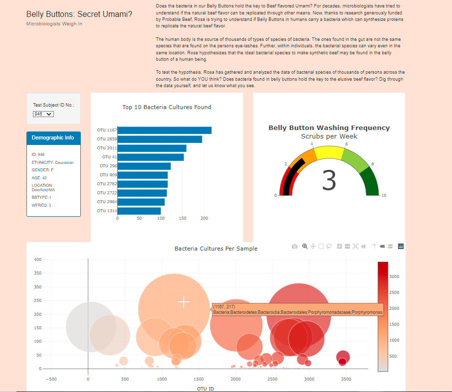
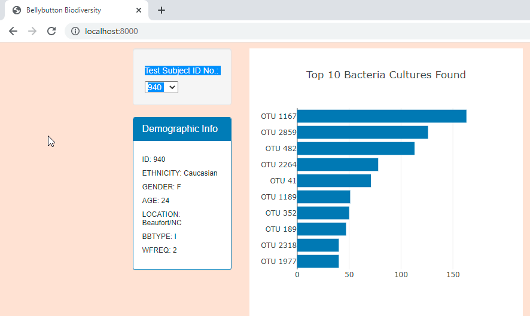
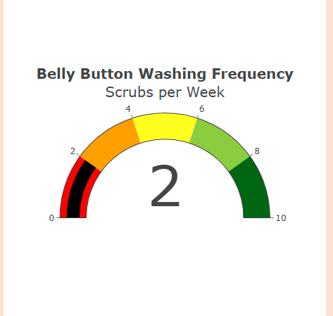
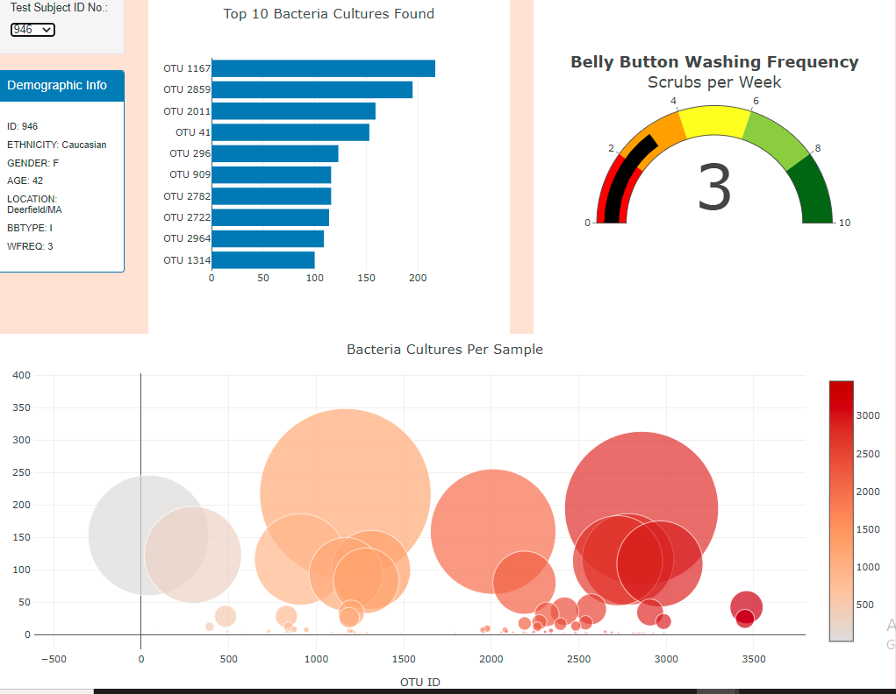
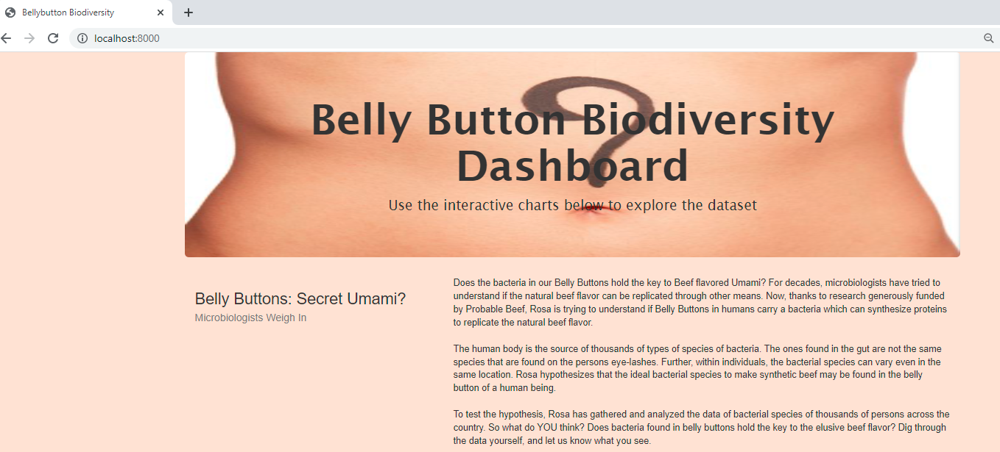

# Belly Button Bacteria
# Module 12 Challenge-

**The webpage dashboard is here: https://soug86.github.io/Belly_Challenge/**

This written analysis contains two sections:

**1. Overview of Project**

**2. Results**

## 1. Overview of the analysis

For decades, microbiologists have tried to understand if the natural beef flavor can be replicated through other means. Now, thanks to research generously funded by Probable Beef, Rosa is trying to understand if Belly Buttons in humans carry a bacteria which can synthesize proteins to replicate the natural beef flavor.

The human body is the source of thousands of types of species of bacteria. The ones found in the gut are not the same species that are found on the persons eye-lashes. Further, within individuals, the bacterial species can vary even in the same location. Rosa hypothesizes that the ideal bacterial species to make synthetic beef may be found in the belly button of a human being.

To test the hypothesis, Rosa has gathered and analyzed the data of bacterial species of thousands of persons across the country. Roza has a partially completed dashboard that she needs to finish. She has a completed panel for demographic information and now needs to visualize the bacterial data for each volunteer. Specifically, her volunteers should be able to identify the top 10 bacterial species in their belly buttons. That way, if Improbable Beef identifies a species as a candidate to manufacture synthetic beef, Roza's volunteers will be able to identify whether that species is found in their navel.

## 2. Results

The results primarily highlights the process of using the search criteria in the webpage. 

Lets assume the user wants to view the details of **ID No 946**

The setps to fiter to this data is as follows:
### **a. Unfiltered view of the webpage:**

The first step is to understand the layout of the webpage as shown in the image below. Below the heading and the description, on the lower left portion of the the screen there is a section called the **Filter Search** with the criteria of subject ID and the corresponding details below. There are three additional charts showing different aspects of the research based on this selection.

*a. Unfiltered Webpage*

### **b. Horizontal Bar chart:**

A horizontal bar chart to display the top 10 bacterial species (OTUs) when an individual’s ID is selected from the dropdown menu on the webpage. The horizontal bar chart will display the `sample_values` as the values, the `otu_ids` as the labels, and the `otu_labels` as the hover text for the bars on the chart.

*b. Bar Chart*

### **c. Bubble chart:**

 A bubble chart that will display the Bacteria Cultures per Sample following when an individual’s ID is selected from the dropdown menu webpage *(image below)*,

*c. Bubble Chart*

### **d. Gauge chart:**

A gauge chart that displays the weekly washing frequency's value, and display the value as a measure from 0-10 on the progress bar when an individual ID is selected from the dropdown menu.  *(image below)*,

*d. Gauge Chart*

### **e. Check if charts change with selection:**

When a different specimenid is selected like **ID 946**, the charts change accordingly  *(image below)*,

*e. Filter*

### **f. Webpage Customization:**

Using HTML and Bootstrap to customize the webpage for your dashboard by adding an image to the jumbotron, adding a background color and adding  more information about the project as a paragraph on the page.  *(image below)*,

*e. Customized Webpage*

